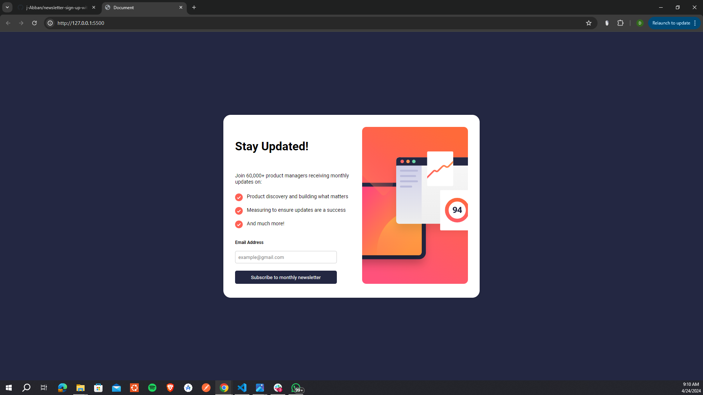

Frontend Mentor - Newsletter sign-up form with success message solution

This is a solution to the Newsletter sign-up form with success message challenge on Frontend Mentor. Frontend Mentor challenges help you improve your coding skills by building realistic projects.

Overview

The challenge

Users should be able to:

- Add their email and submit the form
- See a success message with their email after successfully submitting the form
- See form validation messages if:
- The field is left empty
- The email address is not formatted correctly
- View the optimal layout for the interface depending on their device's screen size
- See hover and focus states for all interactive elements on the page

### Screenshot

### Links

- Solution URL: [Add solution URL here](https://your-solution-url.com)
- Live Site URL: [Add live site URL here](https://your-live-site-url.com)

## My process

### Built with

- Semantic HTML5 markup
- CSS custom properties
- Flexbox
- Mobile-first workflow

### What I learned

During the projecct, i exercised my javascript in the form validation.

Responsive design: Improved understanding of creating responsive layouts to ensure compatibility across different devices.

### Continued development

Focus and better my javascript programming.

### Useful resources

- **[Github Pages Link](https://djangmah500.github.io/newsletter/):** This is the deployed project link. For the deployment I chose to go with Github pages.

- **[Github  Link](https://github.com/djangmah500/newsletter):** This is the link to the github.

